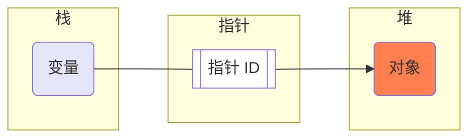
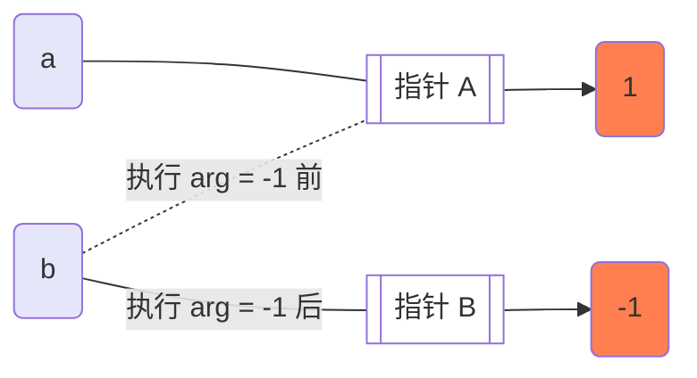
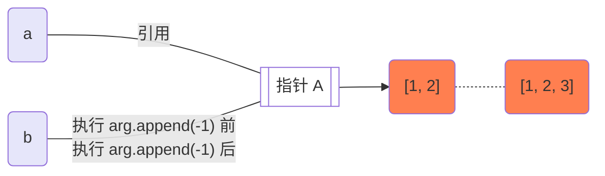
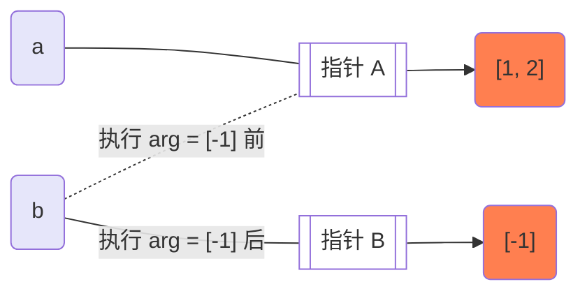

<!-- title: 【Python】Python 可变对象和不可变对象 -->
<!-- date: 2021-10-27 15:53:12 -->
<!-- Table of Content -->

[TOC]

## Python 变量

在 Python 中，<font color="purple">**变量都是指针**</font>；指针的内存空间与数据类型无关，其内存空间保存了指向数据的内存地址。



> 💬**注意**：在 C 中，当定义一个变量后，编译器就一定会给该变量分配内存，后续对该变量的读写是通过该内存地址实现的；而在 Python 中，只会给对象分配内存，。

 

## Python 对象

在 Python 中，<font color="red">==**一切皆对象**==</font>，主要由以下部分组成：

- **identity（ID）**：标识对象的“**内存地址**”，可使用 *id(obj)* 获取（唯一标识）
- **type（类型）**：标识对象的“**类型**”，可使用 *type(obj)* 获取
- **value（值）**：标识对象的“**值**”，可使用 *print(obj)* 获取

> 💬**注意**：**对象的本质是一个内存块**。

> 💬**注意**：变量无类型，对象有类型；**变量位于栈内存，对象位于堆内存**。

在 Python 中，对象可分为<font color="purple">**不可变对象**</font>和<font color="purple">**可变对象**</font>，如下图所示：

<div align="center">

</div>


### 不可变对象

不可变对象包括：**bool（布尔）、int（整数）、float（浮点数）、str（字符串）、tuple（元组）、frozenset（不可变集合）**，具有以下特性：

- 可 hash（不可变长度）
- 不支持新增
- 不支持删除
- 不支持修改
- 支持查询


### 可变对象

可变对象包括：**list（列表）、set（集合）、dict（字典）**，具有以下特性：

- 不可 hash（可变长度）
- 支持新增
- 支持删除
- 支持修改
- 支持查询


## 什么是赋值引用？

**拷贝对象的引用（即指针）**，使得两个变量指向同一个对象。

```python
>>> a = {1: [1, 2, 3]}
>>> b = a
>>> print(a is b)
True
>>> print(id(a))
4468940880
>>> print(id(b))
4468940880
```

<div align="center">

</div>


## 什么是浅拷贝（copy）？

**仅拷贝父对象**，但不拷贝父对象中的子对象。

> 💬**注意**：子对象共享内存，指向同一个对象。

```python
>>> a = {1: [1, 2, 3]}
>>> b = a.copy()
>>> print(a is b)
False
>>> print(id(a))
4468724912
>>> print(id(b))
4468689448
```

<div align="center">

</div>


## 什么是深拷贝（deepcopy）？

**拷贝父对象，同时递归拷贝所有子对象**。

> 💬**注意**：<font color="red">如果子对象为不可变对象，则共享内存；如果子对象为可变对象，则不共享内存。</font>

```python
>>> a = {1: [1, 2, 3]}
>>> import copy
>>> b = copy.deepcopy(a)
>>> print(a is b)
False
>>> print(id(a))
140394609531776
>>> print(id(b))
140394611327680
```

<div align="center">

</div>


## Python 参数传递是值传递还是引用传递？

~~在网上流传着这么一个说法：“对于不可变对象，是值传递；对于可变对象，是引用传递。“~~

在 Python 参数传递中，不存在所谓值传递和引用传递的区分，其本质都是拷贝对象的引用（指针）传递。

```python
>>> def fun(a):
...    return a


>>> b = 1
>>> print(fun(b))
1
```

如上述代码所示，在执行 fun(b) 代码时、其等价执行的是 fun(a=b)，其本质是一种赋值引用；所以<font color="purple">***在 Python 中，对象只存在引用传递。***</font>


## 举个栗子🌰

### 不可变对象\_外部永远不随内部变

```python
# 不可变对象
>>> def fun(b):
...    b = -1
...    return b
>>> a = 1
>>> print(fun(a))
-1
>>> print(a)
1
```




### 可变对象\_外部跟随内部变

```python
# 可变对象
>>> def fun(b):
...    b.append(-1)  # 修改原对象
...    return b


>>> a = [1]
>>> print(fun(a))
[1, -1]
>>> print(a)
[1, -1]
```




### 可变对象\_外部不随内部变

```python
# 可变对象>>> def fun(b):...    b = [-1]  # 产生新对象...    return b>>> a = [1]>>> print(fun(a))[-1]>>> print(a)[1]
```

