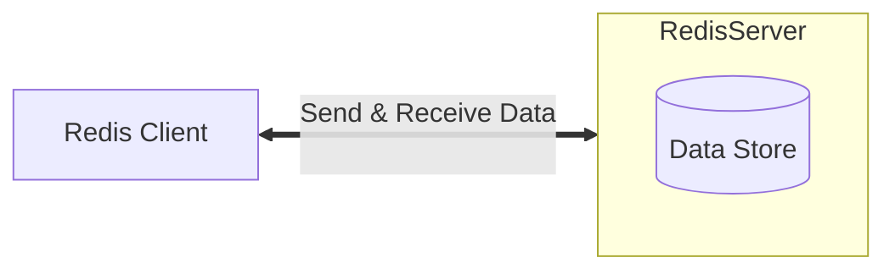

<!-- @title: 【Redis 入门】01、Redis 入门基础 -->
<!-- @date: 2021-12-27 19:43:58 -->
<!-- @author: Zhang Jinbao -->

[TOC]

## Redis 简介

[Redis](https://redis.io/)（<font color="purple">Remote Dictionary Server</font>，远程字典服务）是一个使用 C 语言编写的<font color="purple"> Key-Value </font>的存储系统，是一种跨平台的<font color="purple"> NoSQL 数据库</font>。

在实际应用场景中，Redis 通常作为数据库、缓存以及中间件消息系统。

> 💬说明：Redis 是一个遵守 BSD 协议的开源项目。

> 💬说明：自 2010 年 3 月 15 日起，Redis 的开发和维护由 VMware 赞助支持。

> 💬说明：自 2013 年 5 月起，Redis 的开发和维护由 Pivotal 赞助支持。


## 什么是 NoSQL？

<font color="purple">NoSQL</font>（Not Only SQL，不仅仅是 SQL）泛指非关系型数据库。

### [NoSQL 分类](http://www.nosql-database.org)

NoSQL分类如下所示：

| 分类         | Examples举例                                       | 典型应用场景         | 数据模型     | 优点                                               | 缺点                   |
| ------------ | -------------------------------------------------- | -------------------- | ------------ | -------------------------------------------------- | ---------------------- |
| 键值对数据库 | Redis，Voldemort，Oracle BDB，Tokyo Cabinet/Tyrant | 内容缓存，日志系统等 | Key-Value    | 查询速率快                                         | 数据无结构化           |
| 列存储数据库 | Cassandra，HBase，Riak                             | 分布式的文件系统     | 以列簇式存储 | 查询速率快，可扩展性强                             | 功能相对局限           |
| 文档型数据库 | MongoDb，CouchDB                                   | Web 应用             | Key-Value    | 数据结构要求低（表结构可变，无需预定义表结构）     | 无查询语法，查询速率慢 |
| 图形数据库   | Neo4J，InfoGrid，Infinite Graph                    | 社交网络，推荐系统等 | 图结构       | 利用图结构相关算法（如：最短路径，N 度关系查找等） | 可扩展性弱             |


## Redis 与 MySQL

Redis 与 MySQL 的比较如下所示：

|          | Redis          | MySQL        |
| -------- | -------------- | ------------ |
| 类型     | 非关系型数据库 | 关系型数据库 |
| 存储位置 | 内存和磁盘     | 磁盘         |
| 存储过期 | 支持           | 不支持       |
| 读写性能 | 非常高         | 低           |


## Redis 架构

Redis 架构包括两个部分：

- Redis Client
  - 向服务端发送请求
  - 接收服务端的响应
  - …
- Redis Server
  - 处理客户端请求
  - 存储数据
  - 更新数据
  - …




## Redis 特点

Redis 具有如下特点：

- 原子性

  Redis 所有操作都是原子性的，要么全部被执行，要么一个也没有执行（自动回滚）。

- 读写速率快，并发能力强

  Redis 读写的数据保存在内存中。

- 支持数据持久化

  Redis 可将内存中的数据保存在磁盘中，当出现重启、宕机等情况时可以再次加载进行使用。

- 支持数据多样性

  Redis 支持 string、list、set、zset、hash等数据结构的存储。

- 支持数据备份

  Redis 支持 “Master-Salves” 的数据备份。

- 支持发布/订阅（publish/subscribe）

  Redis 自带发布/订阅机制。

- 支持事务

  Redis 自带支持事务。


## Redis 性能

Redis 是一个高性能的<font color="purple"> Key-Value </font>数据库，其性能测试数据如下：

```markdown
测试完成 50 个并发，执行 100000 个请求：
- 测试数据：256 字节的字符串
- 测试系统：Linux 2.6
-     CPU：X3320 Xeon 2.5GHz
- 执行接口：Loopback（127.0.0.1）
- 执行结果：
	- 读取速率：110,000 次/秒
	- 写入速率：81,000 次/秒
```

> 💬说明：数据来源于 bench-mark。


### Redis 为什么那么快？

- Redis 是单线程，没有竞争锁和切换线程的开销；

- Redis 是基于内存读写的；

- Redis 是基于 key-value 存储的；

- Redis 采用的是多路 IO 复用模型；

- Redis 对 String 类型做了优化（SDS）。

  > 💬说明：在 Redis 数据库中，包含字符串值的键值对在底层实现都是依赖于 SDS 实现。


限制 Redis 性能的因素有：

- 网络 IO 的处理速度；

- 内存大小；

- CPU 数量。

  > 💬说明：CPU 会影响线程数量，线程数量会影响性能。


## Redis 应用场景

- 缓存

  需要经常查询的数据，可以放到 Redis 空间；利用 Redis 的高速率读写性能，一方面可以减少访问时间，另外一方面可以减轻数据库压力。

- 计数器

  包括但不限于：通常用于统计注册用户数，浏览次数，朋友圈点赞数，微博转发次数等。

- 实时防攻击系统

  防止暴力破解，包括但不限于：使用工具不间断地尝试各种密码进行登录等；解决方案一般为使用 Redis 设定单个 IP 每秒访问次数上限，超过阈值则进行自动锁定。

- 设定有效期的应用

  设定一个数据，到一定的时间自动失效；包括但不限于：验证码、登录过期、购物券、红包等。

- 自动去重应用

  利用 Redis 的 set/zset 可以获取某段时间内所有数据去重后的数据。

- 队列

  利用 Redis 的 list 可以构建队列系统，利用 Redis 的 zset 可以构建有优先级的队列系统。

- 秒杀

  利用 Redis 可以构建高并发访问的秒杀队列。

- 消息订阅系统

  利用 Redis 的发布/订阅机制可以构建实时的消息系统，包括但不限于：QQ 群、微信群等。

- …


## Redis 支持的语言

Redis 的 API 支持以下语言：

- ActionScropt
- C
- C++
- C#
- Clojure
- Common Lisp
- Dart
- Erlang
- Go
- Haskell
- Haxe
- Io
- Java
- Node.js
- Lua
- Objective-C
- Perl
- PHP
- Pure Data
- Python
- R
- Ruby
- Scala
- Smalltalk
- Tcl
- …