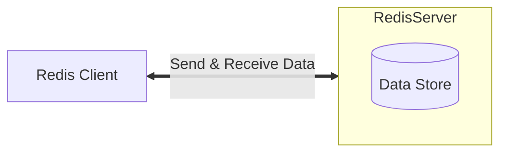

<!-- @title: 【Redis】Redis 入门基础 -->
<!-- @date: 2021-12-27 19:43:58 -->
<!-- @author: Zhang Jinbao -->
<!-- Table of Content -->

[TOC]

## Redis 简介

[**Redis**](https://redis.io/)（<font color="purple">Remote Dictionary Server</font>，远程字典服务）是一个使用 **C 语言**编写的**<font color="purple"> Key-Value </font>**的存储系统，是一种跨平台的**<font color="purple"> NoSQL 数据库（非关系型数据库）</font>**。

在实际应用场景中，Redis 通常作为数据库、缓存以及中间件消息系统。

> 💬**说明**：Redis 是一个遵守 BSD 协议的开源项目。

> 💬**说明**：自 2010 年 3 月 15 日起，Redis 的开发和维护由 VMware 赞助支持。

> 💬**说明**：自 2013 年 5 月起，Redis 的开发和维护由 Pivotal 赞助支持。


## Redis 架构

Redis 架构包括两个部分：

- **Redis Client**
  - 向服务端发送请求
  - 接收服务端的响应
  - …
- **Redis Server**
  - 处理客户端请求
  - 存储数据
  - 更新数据
  - …




## Redis 特点

Redis 具有如下特点：

- **原子性**

  Redis 所有操作都是原子性的，要么全部被执行，要么一个也没有执行（**自动回滚**）。

- **支持数据持久化**

  Redis 可将内存中的数据保存在磁盘中，当出现重启、宕机等情况时可以再次加载进行使用。

- **支持数据多样性**

  Redis 支持 string、list、set、zset、hash等数据结构的存储。

- **支持数据备份**

  Redis 支持 “Master-Salves” 的数据备份。


## Redis 性能

Redis 是一个高性能的**<font color="purple"> Key-Value </font>**数据库，其性能测试数据如下：

```markdown
测试完成 50 个并发，执行 100000 个请求：
- 测试数据：256 字节的字符串
- 测试系统：Linux 2.6
-     CPU：X3320 Xeon 2.5GHz
- 执行接口：Loopback（127.0.0.1）
- 执行结果：
	- 读取速率：110,000 次/秒
	- 写入速率：81,000 次/秒
```

> 💬**说明**：数据来源于 bench-mark。


## Redis 为什么那么快？

- Redis 是单线程，没有竞争锁和切换线程的开销；

- Redis 是基于内存读写的；

- Redis 是基于 key-value 存储的；

- Redis 采用的是多路 IO 复用模型；

- Redis 对 String 类型做了优化（SDS）。

  > 💬**说明**：在 Redis 数据库中，包含字符串值的键值对在底层实现都是依赖于 SDS 实现。


限制 Redis 性能的因素有：

- 网络 IO 的处理速度；

- 内存大小；

- CPU 数量。

  > 💬**说明**：CPU 会影响线程数量，线程数量会影响性能。


## Redis 数据类型

Redis 可提供五种数据类型：**<font color="purple">string、list、set、zset、hash</font>**。

| 数据类型         | 特性                                                      | 适用场景                 |
| ---------------- | --------------------------------------------------------- | ------------------------ |
| string（字符串） | 可以包含任意数据                                          | N/A                      |
| list（双向链表） | 增删快                                                    | 时间线；消息队列         |
| set（集合）      | 增删查复杂度为 O(1)，支持交集、并集、差集等操作           | 共同好友；好友推荐       |
| zset（有序集合） | 增删查复杂度为 O(1)，支持交集、并集、差集等操作，自动排序 | 排行榜；带权重的消息队列 |
| hash（字典）     | 适合存储对象                                              | 存储、读取、修改用户属性 |


### string

string 是最简单的类型，一个 **Key** 对应一个 **Value**。

> 💬**说明**：一个键最大可存储**<font color="red"> 512 MB</font>**。

- 举个栗子🌰

```shell
# SET key value

127.0.0.1:6379> SET redis 2021
OK
127.0.0.1:6379> GET redis
"2021"
```


### list

list 是一个双向链表结构，按照插入顺序排序。

> 💬**说明**：每个 list 最大可存储**<font color="red">  `2^32 - 1` </font>**个元素。

- 举个栗子🌰

```shell
# LPUSH key element ...
# RPUSH key element ...
# LRANGE key start stop

# 从右边插入元素 1
127.0.0.1:6379> RPUSH redis 1
(integer) 1
127.0.0.1:6379> LRANGE redis 0 100
1) "1"
# 从右边插入元素 2
127.0.0.1:6379> RPUSH redis 2
(integer) 2
127.0.0.1:6379> LRANGE redis 0 100
1) "1"
2) "2"
# 从左边插入元素 0
127.0.0.1:6379> LPUSH redis 0
(integer) 3
127.0.0.1:6379> LRANGE redis 0 100
1) "0"
2) "1"
3) "2"
```


### set

set 是 string 类型的无序集合；set 通过哈希表实现的，所以增删查的复杂度都是**<font color="purple"> O(1)</font>**。

> 💬**说明**：每个 set 最大可存储**<font color="red">  `2^32 - 1` </font>**个成员。

> 💬**说明**：set 中每个成员具有**<font color="red">  `唯一性` </font>**（自动去重）。

- 举个栗子🌰

```shell
# SADD key member ...
# SMEMBERS key

# 添加成员 1
127.0.0.1:6379> SADD redis 1
(integer) 1
# 添加成员 2
127.0.0.1:6379> SADD redis 2
(integer) 1
# 添加成员 0
127.0.0.1:6379> SADD redis 0
(integer) 1
# 添加成员 1（自动去重，返回 0）
127.0.0.1:6379> SADD redis 1
(integer) 0
127.0.0.1:6379> SMEMBERS redis
1) "0"
2) "1"
3) "2"
```


### zset

zset 是有序的 set；但与 set 不同的是，zset 中的每个成员都会关联一个**double 类型**的 **`score`**（Redis 根据`score`值对成员进行从小到大的排序）。

> 💬**说明**：每个 zset 最大可存储**<font color="red">  `2^32 - 1` </font>**个成员。

> 💬**说明**：zset 中每个成员具有**<font color="red">  `唯一性` </font>**（自动去重），但**<font color="red"> 每个 score 可以重复</font>**。

- 举个栗子🌰

```shell
# ZADD key score member ...
# ZRANGEBYSCORE key min max

127.0.0.1:6379> ZADD redis 0 0
(integer) 1
127.0.0.1:6379> ZADD redis 0 1
(integer) 1
127.0.0.1:6379> ZADD redis 0 2
(integer) 1
127.0.0.1:6379> ZADD redis 0 2
(integer) 0
127.0.0.1:6379> ZRANGEBYSCORE redis 0 100
1) "0"
2) "1"
3) "2"
```


### hash

hash 是一个 string 类型的键值对（field：Value）集合，适用于存储对象。

> 💬**说明**：每个 hahs 最大可存储**<font color="red">  `2^32 - 1` </font>**个键值对。

> 💬**说明**：hash 类似于 Java 中的 `map`。

- 举个栗子🌰

```shell
# HSET key field value ...
# HMSET key field value ...
# HGET key field

# 添加 0：1
127.0.0.1:6379> HSET redis 0 1
(integer) 1
# 更新 field=0 的值
127.0.0.1:6379> HSET redis 0 2
(integer) 0
# 添加 1：2
127.0.0.1:6379> HSET redis 1 2
(integer) 1
# 添加 2：3
127.0.0.1:6379> HSET redis 2 3
(integer) 1
127.0.0.1:6379> HGET redis 0
"2"
127.0.0.1:6379> HGET redis 1
"2"
127.0.0.1:6379> HGET redis 2
"3"
```


## Redis 支持语言

Redis 的 API 支持以下语言（排名不分先后）：

- ActionScropt
- C
- C++
- C#
- Clojure
- Common Lisp
- Dart
- Erlang
- Go
- Haskell
- Haxe
- Io
- Java
- Node.js
- Lua
- Objective-C
- Perl
- PHP
- Pure Data
- Python
- R
- Ruby
- Scala
- Smalltalk
- Tcl
- …