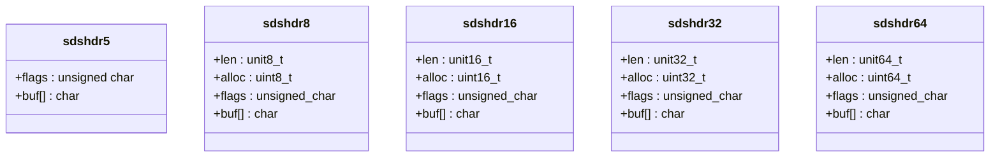

<!-- @title: 【Redis】Redis 底层数据结构 -->
<!-- @date: 2022-01-04 13:33:18 -->
<!-- @author: Zhang Jinbao -->
<!-- Table of Content -->

[TOC]

## String 简介

string 对象的编码类型可以是：

- **int**

- **embstr**

  > 💬**说明**：embstr 是 Redis 用于专门保存字符串的优化编码方式。

- **raw（SDS）**

  > 💬**说明**：在 Redis 数据库中，包含字符串值的键值对底层实现都是基于 SDS 实现的。


## String 何时使用何种编码类型？

具体规则如下：

- 判断字符串是否都为数字？
  - 是，则判断数字是否 ≤2^64 - 1？
    - 是，则采用`int`;
    - 否，则判断字符串长度是否 ≤32 字节？
      - 是，则采用`embstr`；
      - 否，则采用`raw`。
  - 否，则判断字符串长度是否 ≤32 字节？
    - 是，则采用`embstr`；
    - 否，则采用`raw`。

> 💬**说明**：测试版本为 Redis 6.2.6。


## SDS（Simple Dynamic String）

### 数据结构

其数据结构定义如下：

```c
// 定义 SDS
struct sdshdr{
    // 记录 buf 数组已使用的字节长度
    int len;
    // 记录 buf 数组中未使用的字节长度
    int free;
    // 字节数组，用于保存字符串
    char buf[];
};
```

其内存分配图如下：

<div align="center">

</div>


### Redis 为什么没有直接使用 C 语言中的 string，而是采用 SDS 呢？

主要基于以下几个原因：

| SDS 字符串                                    | C 语言字符串                                  |
| --------------------------------------------- | --------------------------------------------- |
| 获取字符串长度的复杂度为 O(1)                 | 获取字符串长度的复杂度为 O(n)                 |
| API 安全                                      | API 不安全                                    |
| 不会造成缓冲区溢出                            | 可能会造成缓冲区溢出                          |
| 修改字符串长度 N 次需执行的内存重分配次数：≤N | 修改字符串长度 N 次需执行的内存重分配次数：=N |
| 可以保存文本数据、或二进制数据                | 只能保存文本数据                              |
| 可以使用一部分<string.h>库函数                | 可以使用所有<string.h>库函数                  |


### SDS 为什么定义 `len`？

- C 语言的 string 类型

  - 获取字符串长度需遍历实现，复杂度为 O(n)；

  - 读取字符串依赖终止符`\0`，比如：“Hello”=>[‘H’, ‘e’, ‘l’, ‘l’, ‘o’, ‘\0’]；

    > 💬**说明**：`\0`标识字符串的结束。

    > 💬**说明**：当有一个字符串包含了一个空字符时，在 C 语言中，这个数据只能被识别到空字符前面部分的数据，导致数据不完整。

  - 不能保证二进制安全（只能保存文本数据，无法保存图片、音频、视频等数据）。

  > 💬**说明**：C 语言的 `string` 类型和其他语言差不多，底层使用 `char[]`实现.

- Redis 的 string 类型

  - 获取字符串长度只需读取 `len` 属性，复杂度为 O(1)；
  - 读取字符串不依赖终止符`\0`，依赖 `len` 属性；
  - **二进制安全**（可以保存文本数据，也可以保存图片、音频、视频等数据）。


### SDS 为什么定义 free？

在 C 语言中，每次字符串增长都会重新分配一次内存空间，重新分配内存会损耗其性能。

而在 Redis 中，存储数据的`char buf[];`的实际大小为：**len + free + 1**（）

- len：`buf[]`已使用的空间大小；
- free：`buf[]`未使用的空间大小；
- 1：存储终止符`\0`。

> 💬**说明**：`char buf[]`分配的实际内存空间是大于实际存储的字符串长度的。


那么为什么要定义 free 空间呢？

- 预分配空间，防止每次修改都需要重新分配空间；
- 防止缓存区溢出。

在 C 语言中，当进行字符串的拼接、复制等操作时，一旦没有分配足够长度的内存空间，很容易造成**缓存区溢出**。

而在 Redis 中，当进行字符串的拼接时，SDS 会进行如下处理：

- free 空间是否 ≥目标字符串长度；
  - 是，则进行修改操作；
  - 否，则先进行空间扩容，再进行修改操作。

其 SDS 扩容机制如下：

<div align="center">

</div>


### SDS 如何释放内存？

Redis 采用**<font color="purple">惰性空间释放</font>**机制。

当字符串出现缩减时，不会重新分配内存空间，而是通过减少`len`、增加`free`的方式来空大内存空间，好处在于可减少内存重新分配。

其 SDS 释放内存机制如下：

<div align="center">

</div>


### SDS 如何做内存优化？

由于 Redis 是属于惰性空间释放，但凡出现一次字符串增加时，内存空间就会被永久占用了，那么如何来解决该问题呢？

为了解决以上问题，Redis 针对不同长度的 `string` 类型定制了不同的存储结构：

- sdshdr5
- sdshdr8
- sdshdr16
- sdshdr32
- sdshdr64



其他数据结构如下：

```c
/* Note: sdshdr5 is never used, we just access the flags byte directly.
 * However is here to document the layout of type 5 SDS strings. */
struct __attribute__ ((__packed__)) sdshdr5 {
  	// 低 3 位存储类型，高 5 位存储长度
    unsigned char flags; /* 3 lsb of type, and 5 msb of string length */
    // 字节数组
  	char buf[];
};
struct __attribute__ ((__packed__)) sdshdr8 {
   	// 字节数组已使用的长度（1 字节）
  	uint8_t len; /* used */
  	// 字节数组分配的总长度（1 字节）--不包括头部和终止符
    uint8_t alloc; /* excluding the header and null terminator */
    // 低 3 位存储类型
  	unsigned char flags; /* 3 lsb of type, 5 unused bits */
    // 字节数组
  	char buf[];
};
struct __attribute__ ((__packed__)) sdshdr16 {
  	// 字节数组已使用的长度（2 字节）
    uint16_t len; /* used */
    // 字节数组分配的总长度（2 字节）--不包括头部和终止符
  	uint16_t alloc; /* excluding the header and null terminator */
    // 低 3 位存储类型
  	unsigned char flags; /* 3 lsb of type, 5 unused bits */
    // 字节数组
  	char buf[];
};
struct __attribute__ ((__packed__)) sdshdr32 {
  	// 字节数组已使用的长度（4 字节）
    uint32_t len; /* used */
  	// 字节数组分配的总长度（4 字节）--不包括头部和终止符
    uint32_t alloc; /* excluding the header and null terminator */
    // 低 3 位存储类型
  	unsigned char flags; /* 3 lsb of type, 5 unused bits */
    // 字节数组
  	char buf[];
};
struct __attribute__ ((__packed__)) sdshdr64 {
  	// 字节数组已使用的长度（8 字节）
    uint64_t len; /* used */
  	// 字节数组分配的总长度（8 字节）--不包括头部和终止符
    uint64_t alloc; /* excluding the header and null terminator */
    // 低 3 位存储类型
  	unsigned char flags; /* 3 lsb of type, 5 unused bits */
    // 字节数组
  	char buf[];
};
```

- **`len`**：buf[] 数组已使用的长度
- **`alloc`**：buf[] 数组分配的总长度
- **`flags`**：低 3 位表示存储的类型
- **`buf[]`**：存储字符串数据的内存空间

> 💬**说明**：free = alloc - len。

#### sdshdr5

其数据结构如下：

```c
struct __attribute__ ((__packed__)) sdshdr5 {
  	/* 3 lsb of type, and 5 msb of string length */
  	// 低 3 位存储类型，高 5 位存储长度
    unsigned char flags; 
  	// 字节数组，用于保存字符串
    char buf[];
};
```

> 💬**说明**：sdshdr5 可存储的长度区间为 0 到 31（2^5 - 1）。

其内存分配图如下：

<div align="center">

</div>


### SDS 如何区分不同的存储类型呢？

```c
#define SDS_TYPE_5  0
#define SDS_TYPE_8  1
#define SDS_TYPE_16 2
#define SDS_TYPE_32 3
#define SDS_TYPE_64 4

static inline char sdsReqType(size_t string_size) {
    if (string_size < 1<<5)
        return SDS_TYPE_5;
    if (string_size < 1<<8)
        return SDS_TYPE_8;
    if (string_size < 1<<16)
        return SDS_TYPE_16;
		#if (LONG_MAX == LLONG_MAX)
    if (string_size < 1ll<<32)
        return SDS_TYPE_32;
    return SDS_TYPE_64;
		#else
    		return SDS_TYPE_32;
		#endif
}

sds _sdsnewlen(const void *init, size_t initlen, int trymalloc) {
    void *sh;
    sds s;
  	/* 计算出字符串长度，选择不同的SDS的类型 */
    char type = sdsReqType(initlen);
    /* Empty strings are usually created in order to append. Use type 8
     * since type 5 is not good at this. */
  	/*SDS_TYPE_5  转换成SDS_TYPE_8 */
    if (type == SDS_TYPE_5 && initlen == 0) type = SDS_TYPE_8;
  	 /* 计算不同的头部需要长度 */
    int hdrlen = sdsHdrSize(type);
  	/* flags 指针 */
    unsigned char *fp; /* flags pointer. */
    size_t usable;

  	/* 分配内存，+1 是用来存储\0，用于兼容 C 语言 */
    assert(initlen + hdrlen + 1 > initlen); /* Catch size_t overflow */
    sh = trymalloc?
        s_trymalloc_usable(hdrlen+initlen+1, &usable) :
        s_malloc_usable(hdrlen+initlen+1, &usable);
    if (sh == NULL) return NULL;
    if (init==SDS_NOINIT)
        init = NULL;
    else if (!init)
        memset(sh, 0, hdrlen+initlen+1);
    s = (char*)sh+hdrlen;
    fp = ((unsigned char*)s)-1;
    usable = usable-hdrlen-1;
    if (usable > sdsTypeMaxSize(type))
        usable = sdsTypeMaxSize(type);
  	/* 根据不同的类型，初始化 sdsHeader */
    switch(type) {
        case SDS_TYPE_5: {
            *fp = type | (initlen << SDS_TYPE_BITS);
            break;
        }
        case SDS_TYPE_8: {
            SDS_HDR_VAR(8,s);
            sh->len = initlen;
            sh->alloc = usable;
            *fp = type;
            break;
        }
        case SDS_TYPE_16: {
            SDS_HDR_VAR(16,s);
            sh->len = initlen;
            sh->alloc = usable;
            *fp = type;
            break;
        }
        case SDS_TYPE_32: {
            SDS_HDR_VAR(32,s);
            sh->len = initlen;
            sh->alloc = usable;
            *fp = type;
            break;
        }
        case SDS_TYPE_64: {
            SDS_HDR_VAR(64,s);
            sh->len = initlen;
            sh->alloc = usable;
            *fp = type;
            break;
        }
    }
    if (initlen && init)
        memcpy(s, init, initlen);
    s[initlen] = '\0';
    return s;
}

sds sdsnewlen(const void *init, size_t initlen) {
    return _sdsnewlen(init, initlen, 0);
}
```

