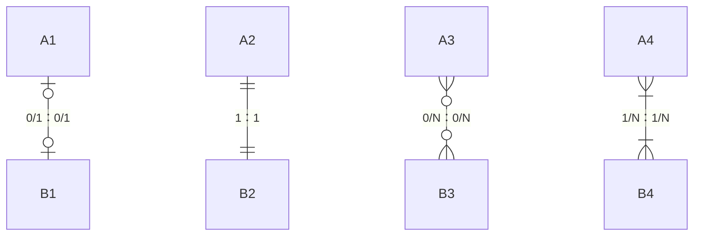

<!-- @title: 【Test】手把手教你画图？ -->
<!-- @date: 2021-10-29 18:13:21 -->
<!-- @author: Zhang Jinbao -->
<!-- Table of Content -->

[TOC]

## E-R 图

```markdown
- 中文名：实体-关系图
- 外文名：Entity Relationship Diagram
- 简  称：E-R 图
- 类  别：概念模型
```

E-R 图也称为“**实体关系图（Entity Relationship Diagram）**”，提供了表示实体类型、属性和联系的方法，是用来表示述现实世界概念关键模型的一种方式。

> **💬说明**：E-R 图常用于数据库设计中。

### 构图要素

- <font color="purple">**实体**</font>：`矩形框`

  实体客观上可以相互区分的事物，可以是具体的人和物、也可以是抽象的概念与联系。

- <font color="purple">**属性**</font>：`椭圆形框`

  实体所具有的特性。

  > **💬说明**：属性不能脱离实体。

- <font color="purple">**联系**</font>：`菱形框`

  联系也称为关系，用于反应实体之间的关联。

- <font color="purple">**联系类型**</font>：`1` 或 `N`

  - 1：1
  - 1：N
  - N：1
  - M：N

- <font color="purple">**连接线**</font>：`实线`

<div align="center">

</div>


## 举个栗子🌰



