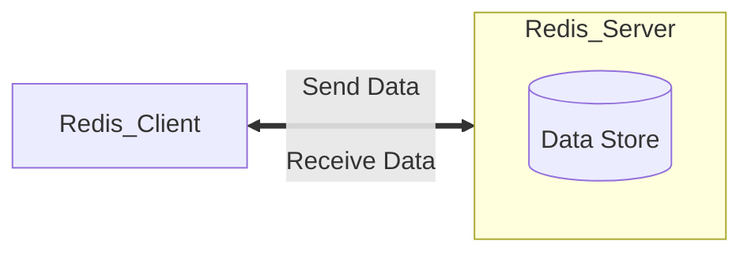

<!-- @author: Zhang Jinbao -->

<!-- @date: 2021-12-27 19:43:58 -->

[TOC]

---

## Redis 简介

[Redis](https://redis.io/)（**Remote Dictionary Server**，远程字典服务）是一个使用 C 语言编写的<font color="purple"> Key-Value </font>的存储系统，是一种跨平台的<font color="purple"> **NoSQL 数据库**</font>。

> ***💬说明：*** *Redis 是一个遵守 BSD 协议的开源项目。*

> ***💬说明：***
>
> 1. *自 2010 年 3 月起，Redis 的开发和维护由 VMware 赞助支持；*
>
> 2. *自 2013 年 5 月起，Redis 的开发和维护由 Pivotal 赞助支持。*


## 什么是 NoSQL？

<font color="purple">**NoSQL**</font>（Not Only SQL，不仅仅是 SQL）泛指**非关系型数据库**。


## 为什么需要 NoSQL？

- **High Performance**（高并发读写）

- **Huge Storage**（海量数据的高效率存储）

- **High Scalability**（高可扩展性）

  > ***💬说明：*** *关系型数据库数据横向扩展[^1]和纵向扩展[^2]的难度较大。*

  [^1]:横向扩展（Scale Out）是通过在分布式应用中**添加新的服务实例**，如：新增一个库、新增一台服务器。
  [^2]:纵向扩展（Scale Up）是通过**提高单个系统的处理能力**的方法解决问题，如：加内存、加线程数等。

- **High Availability**（高可用性）


## [NoSQL 分类](http://www.nosql-database.org)

| <span style="display:inline-block;width: 100px">分类</span> | <span style="display:inline-block;width: 200px">举个栗子🌰</span> | <span style="display:inline-block;width: 150px">应用场景</span> | <span style="display:inline-block;width: 100px">数据模型</span> | <span style="display:inline-block;width: 100px">优势</span> | <span style="display:inline-block;width: 100px">劣势</span> |
| :---------------------------------------------------------- | :----------------------------------------------------------- | ------------------------------------------------------------ | ------------------------------------------------------------ | ----------------------------------------------------------- | ----------------------------------------------------------- |
| **键值对数据库**                                            | Redis、Voldemort、Oracle BDB、Tokyo Cabinet/Tyrant           | 内容缓存，日志系统等                                         | Key-Value                                                    | 查询速率快                                                  | 数据无结构化                                                |
| **列存储数据库**                                            | Cassandra、HBase、Riak                                       | 分布式的文件系统                                             | 以列簇式存储                                                 | 查询速率快，可扩展性强                                      | 功能相对局限                                                |
| **文档型数据库**                                            | MongoDB、CouchDB                                             | Web 应用                                                     | Key-Value                                                    | 数据结构要求低（表结构可变，无需预定义表结构）              | 无查询语法，查询速率慢                                      |
| **图形数据库**                                              | Neo4J、InfoGrid、Infinite Graph                              | 社交网络，推荐系统等                                         | 图结构                                                       | 利用图结构相关算法（如：最短路径，N 度关系查找等）          | 可扩展性弱                                                  |


## Redis 与 MySQL

Redis 与 MySQL 的比较如下所示：

|          |     Redis      |    MySQL     |
| :------: | :------------: | :----------: |
|   类型   | 非关系型数据库 | 关系型数据库 |
| 存储位置 |   磁盘和内存   |     磁盘     |
| 存储过期 |      支持      |    不支持    |
| 读写性能 |     非常高     |      低      |


## Redis 架构

Redis 架构包括两个部分：

- <font color="blue">**Redis Client**</font>
  - 向服务端发送请求
  - 接收服务端的响应
  - …
- <font color="blue">**Redis Server**</font>
  - 处理客户端请求
  - 存储数据
  - 更新数据
  - …




## Redis 特点

- <font color="blue">**原子性**</font>

  Redis 所有操作都是原子性的，要么全部被执行，要么一个也没有执行（自动回滚）。

- **读写速率快，并发能力强**

  Redis 读写的数据保存在内存中。

- **支持数据持久化**

  Redis 可将内存中的数据保存在磁盘中，当出现重启、宕机等情况时可以再次加载进行使用。

- **支持数据多样性**

  Redis 支持 STRING、LIST、SET、ZSET、HASH 等数据结构的存储。

- **支持集群**

  Redis 支持 “Master-Salves” 的数据备份。

- **支持发布/订阅（publish/subscribe）**

  Redis 自带发布/订阅机制。

- **支持事务**

  Redis 自带支持事务。


## Redis 性能

Redis 是一个高性能的<font color="purple"> Key-Value </font>数据库，其性能测试数据如下：

```markdown
测试完成 50 个并发，执行 100000 个请求
- 测试数据：256 字节的字符串
- 测试系统：Linux 2.6
-     CPU：X3320 Xeon 2.5GHz
- 执行接口：Loopback（127.0.0.1）
- 执行结果：
	- 读取速率：110,000 次/秒
	- 写入速率：81,000 次/秒
```

> ***💬说明：*** *数据来源于 bench-mark。*

- **Redis 为什么那么快？**

  - Redis 是单线程，没有竞争锁和切换线程的开销；


  - Redis 是基于内存读写的；


  - Redis 是基于 key-value 存储的；


  - Redis 采用的是多路 IO 复用模型；


  - Redis 对 String 类型做了优化（SDS）。

    > ***💬说明：*** *在 Redis 数据库中，包含字符串值的键值对在底层实现都是依赖于 SDS 实现。*


- **限制 Redis 性能的因素有哪些？**

  - 网络 IO 的处理速度；


  - 内存大小；


  - CPU 数量。

    > ***💬说明：*** *CPU 会影响线程数量，线程数量会影响性能。*


## Redis 应用场景

- **缓存**

  需要经常查询的数据，利用 Redis 的高速读写性能，一方面可以减少访问时间，另外一方面可以减轻数据库压力。

- **队列**

  利用 Redis 的 LIST 可以构建队列系统，利用 Redis 的 ZSET 可以构建有优先级的队列系统，包括但不限于：秒杀活动等。

- **消息订阅系统（中间件消息系统）**

  利用 Redis 的发布/订阅机制可以构建实时的消息系统，包括但不限于：QQ 群、微信群等。

- **计数器**

  包括但不限于：注册用户数、网页浏览次数、接口访问次数、朋友圈点赞数、微博转发次数等。

- **实时防攻击系统**

  防止暴力破解，包括但不限于：使用工具不间断地尝试密码进行登录（解决方案为使用 Redis 设定单个 IP 每秒访问次数上限，超过阈值则进行自动锁定）等。。

- **设定有效期的应用**

  设定一个数据，到一定的时间自动失效，包括但不限于：验证码、登录过期、购物券、红包等。

- **自动去重应用**

  利用 Redis 的 SET/ZSET 可以获取某段时间内所有数据去重后的数据，包括但不限于：共同好友、好友推荐、排行榜等。

- …


## Redis 支持的语言

Redis 的 API 支持以下语言：

- ActionScropt
- C
- C++
- C#
- Clojure
- Common Lisp
- Dart
- Erlang
- Go
- Haskell
- Haxe
- Io
- Java
- Node.js
- Lua
- Objective-C
- Perl
- PHP
- Pure Data
- Python
- R
- Ruby
- Scala
- Smalltalk
- Tcl
- …


## Redis 数据类型

Redis 可提供五种数据类型：<font color="purple">**STRING、LIST、SET、ZSET、HASH**</font>。

| <span style="display:inline-block;width: 100px">类型</span> | <span style="display:inline-block;width: 100px">特性</span> | <span style="display:inline-block;width: 100px">适用场景</span> |
| ----------------------------------------------------------- | ----------------------------------------------------------- | ------------------------------------------------------------ |
| **STRING**                                                  | 可以包含任意数据                                            | N/A                                                          |
| **LIST**                                                    | 增删快                                                      | 时间线，消息队列                                             |
| **SET**                                                     | 增删查复杂度为 O(1)，支持交集、并集、差集等操作             | 共同好友，好友推荐                                           |
| **ZSET**                                                    | 增删查复杂度为 O(1)，支持交集、并集、差集等操作，自动排序   | 排行榜，带权重的消息队列                                     |
| **HASH**                                                    | 适合存储对象                                                | 存储、读取、修改用户属性                                     |
