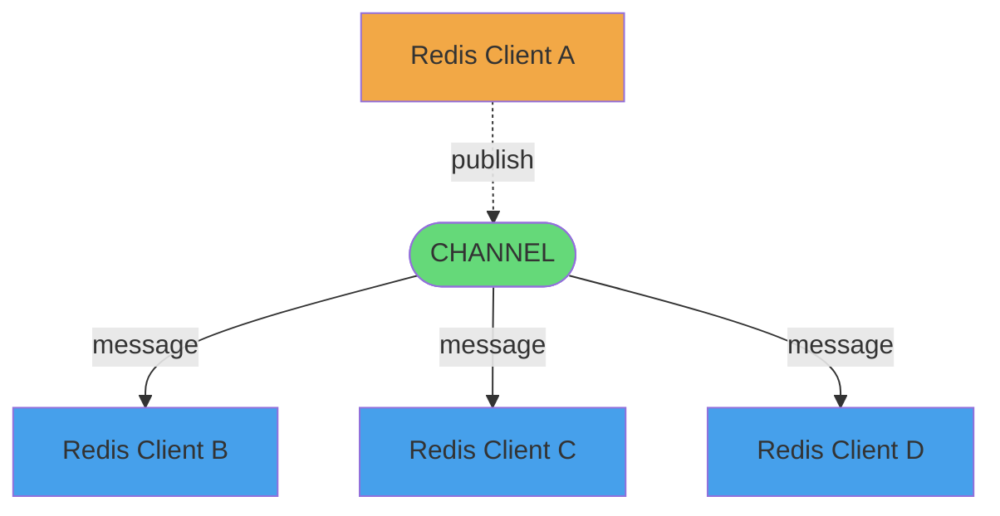
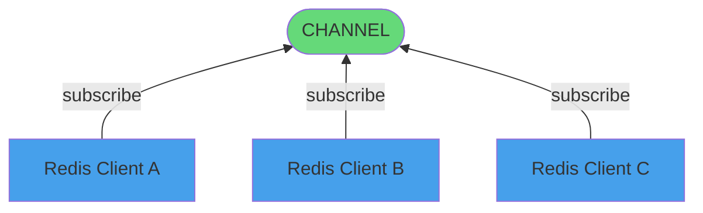
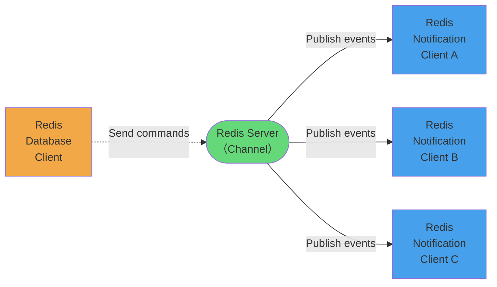

<!-- @title: 【Redis 入门】03、Redis 发布订阅机制 -->
<!-- @date: 2021-12-29 11:58:08 -->
<!-- @author: Zhang Jinbao -->

[TOC]

## Redis 发布订阅

Redis 提供了发布订阅（PUBLISH/SUBSCRIBE）机制，可以用于消息的传输；主要由以下三个部分组成：

- PUBLISHER（发布者）
- Channel（频道）
- SUBSCRIBER（订阅者）

Redis 的发布者和订阅者都是 Redis 客户端，而 Channel 则为 Redis 服务端。

发布者将消息发送到指定的 Channel，该 Channel 的订阅者就能接收到这条消息。

Redis 发布订阅机制与数据存储是无关的，即不会影响 Redis 存储的数据。

> 💬说明：Redis 客户端可以订阅任意数量的频道。

### 发布



### 订阅




### 发送

Redis 采用

Redis采用PUBLISH命令发送消息，其返回值为接收到该消息的订阅者的数量。 

Redis采用SUBSCRIBE命令订阅某个频道，其返回值包括客户端订阅的频道，目前已订阅的频道数量，以及接收到的消息，其中subscribe表示已经成功订阅了某个频道。 


## SUBSCRIBE

当客户端订阅某个频道时，Redis 会将该客户端与该频道进行绑定。

在 `client` 结构体定义中，使用 `pubsub_channels` 声明该客户端订阅的所有频道。

- key：订阅的频道
- value：空
- next：
- 其中每个元素都包含了一个键值对以及指向下一个元素的指针，每次订阅都要向其中插入一个节点，键标识订阅的平淡，值为空

```c
typedef struct client {
  	...
    dict *pubsub_channels;  /* channels a client is interested in (SUBSCRIBE) */
    list *pubsub_patterns;  /* patterns a client is interested in (SUBSCRIBE) */
  	...
} client;
```


## PSUBSCRIBE

在 `redisServer` 结构体定义中，使用 `pubsub_channels` 声明该服务端中所有的频道以及订阅了这个频道的客户端

- 键：频道
- 值：订阅这个频道的所有客户端组成的链表
- nex：指针

```c
struct redisServer {
    ...
    /* Pubsub */
    dict *pubsub_channels;  /* Map channels to list of subscribed clients */
    dict *pubsub_patterns;  /* A dict of pubsub_patterns */
    int notify_keyspace_events; /* Events to propagate via Pub/Sub. This is an
                                   xor of NOTIFY_... flags. */
  	...
};
```


当客户端订阅某个频道时，Redis需要将该频道和该客户端绑定。首先，在客户端结构体client中，有一个属性为pubsub_channels，该属性表明了该客户端订阅的所有频道，它是一个字典类型，通过哈希表实现，其中的每个元素都包含了一个键值对以及指向下一个元素的指针，每次订阅都要向其中插入一个结点，键表示订阅的频道，值为空。然后，在表示服务器端的结构体redisServer中，也有一个属性为pubsub_channels，但此处它表示的是该服务器端中的所有频道以及订阅了这个频道的客户端，它也是一个字典类型，插入结点时，键表示频道，值则是订阅了这个频道的所有客户端组成的链表。最后Redis通知客户端其订阅成功。


## Redis Keyspace Notifications

Redis 发布订阅机制可提供一个<font color="red">` Keyspace Notification `</font>功能，允许客户端通过订阅特定的频道（Channel），从而感知是否有发生改变 Redis 数据的事件。

### 举个栗子🌰

当有一个客户端删除了 Redis 中键为“Key_A”的数据，该操作会触发两条消息：

- Key_A DEL：属于频道的 `Keyspace`，表示 Keyspace 发生的变化
- DEL Key_A：属于频道的 `keyevent`，表示执行的操作




## Redis 发布订阅与 ActiveMQ

| 维度              | Redis  | ActiveMQ |
| ----------------- | ------ | -------- |
| 消息协议（AMQP）  | 不支持 | 支持     |
| 消息协议（MQTT）  | 不支持 | 支持     |
| 消息协议（Stomp） | 不支持 | 支持     |
| 消息持久化        | 不支持 | 支持     |
| 消息重传          | 不支持 | 支持     |
| 可靠性            | 低     | 高       |
| 复杂程度          | 简单   | 复杂     |