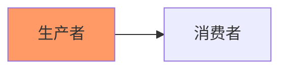
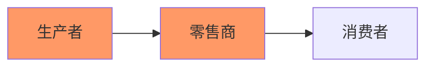
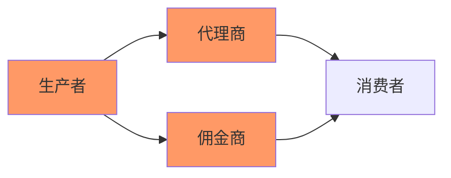

<!-- @title: 【电子商务】分销 -->
<!-- @date: 2021-10-29 16:10:21 -->
<!-- @author: Zhang Jinbao -->

[TOC]

## 分销

分销会独立建立销售渠道（分销渠道/营销渠道），实现产品从生产商向消费者的转移。

- 调查研究
- 促销
- 谈判
- 编配
- 订货
- 物流
- 风险承担
- …

### 零级分销

无中间商赚差价。

### 一级分销

一个中间商赚差价。

- 消费者市场

- 行业市场

### 二级分销

中间商的人脉一般般。

- 消费者市场

  > 批发商 → 消费者
  >
  > 零售商 → 消费者

- 行业市场

  > 销售代理商 → 消费者
  >
  > 批发商 → 消费者

###   三级分销

中间商不行，毫无利润可言。
