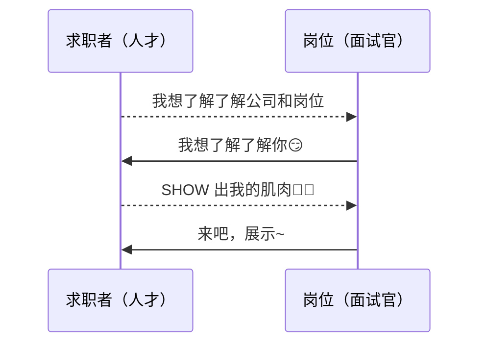

<!-- @author: Zhang Jinbao -->

<!-- @date: 2021-11-06 13:51:50 -->

[TOC]

---

## 面试，你真的了解吗？

面试是一个**双向选择**的过程。



<div align="center">
    
</div>
<div align="center">
    
</div>


## [自我介绍](https://www.nowcoder.com/study/live/735/2/1)

面试第一关，如何精彩出场？

🕛️时间：<font color="red">**2 ~ 3 分钟**</font>

### 自我介绍目的

- **针对求职者**
  - 突出个人亮点（能力）
  - 展示表达能力
  - 形成初步印象
  - …

- **针对面试官**
  - 面试开场
  - 初步了解个人信息
  - 留时间看简历
  - cue 流程
  - …


### 5 句公式法

- **1 句话开头：我是谁？**
  - 姓名（读重音）
  - 学校
  - 专业
  - 目前公司
  - 目前岗位
  - …

```html
面试官，你好！
我叫马化腾，毕业于深圳大学，计算机专业，目前就职于腾讯，担任执行董事。
```

- **3 句话展开：用经历突出个人亮点！**
  1. 【显性】聊聊经历
  2. 【显性】阐述成果
  3. 【隐性】突出能力

```html
在校期间先后获得了国家奖学金、三好学生等奖项，担任过班长、团支书等职务，并被评为了优秀班干部。
我曾在腾讯实习，岗位是执行董事，主要负责制定公司战略规划，2021年营业收入达到5601.18亿元，同比增长16.19%。

```

- **1 句话总结：我为什么想要这份工作？**
  - 结合岗位要求
  - 一句话表达你的意愿
  - 引导面试官对你的自我介绍形成整体评价


```html
我具备丰富的软件测试经验，熟悉功能、业务、接口、自动化、性能以及安全等测试技能，熟悉 Python、Java、GO、SQL、Linux、Redis、MQ 等编程能力；我个人认为贵公司的这个岗位和我的契合度很高，希望能够加入贵公司，和企业一同成长与发展。
```


```html
面试官你好！
我叫马化腾，毕业于深圳大学，计算机专业。
我曾在锐捷先后参加了约二十次软件项目，担任过测试、TL、PTM 等职位，多次获得了项目嘉奖和被评为“优秀员工”。
```


### 技巧一：结合岗位提炼亮眼经历

1. 查看岗位要求
2. 提取关键字
3. 列举自身经历
4. 进行匹配
5. 提取亮眼经历


### 技巧二：数据表述，量化结果

数据表述使得你的成就更清晰直白。

- 举个栗子🌰

  > 大三时参加了全国大学生广告艺术大赛，期间带领队员进行了广告短视频的创造，并得到了<font color="red"> 1,000,000+ </font>点赞，最终带领团队取得了<font color="red">全国一等奖</font>。


### 技巧三：巧妙过度，反客为主

引导面试官进行提问，反客为主。

- 举个栗子🌰

  > 以上是我的一些经历。当然啦，我的简历上还详细写了其他的经历，如果感兴趣可以尽情向我提问~


### 举个栗子1🌰

```markdown
```


### 举个栗子2🌰

```markdown
	面试官，您好！
	很荣幸参加贵公司的此次面试。
（# 介绍个人信息）
	我叫____，毕业于____，____专业。

（# 3个关键词+支撑案例）
	正如简历中所看到的，我希望用3个关键词来介绍自己。

第1， 自学能力强。
	毕业之后，我加入了一家网络通信的公司（锐捷网络）、担任软件测试的工作，虽然作为一名应届毕业生、既没有丰富的工作经验、所学专业也并不是那么对口，但是我能很快地融入工作和团队中。
	并且在试用期转正答辩上，获得了部门内唯一的“优秀新员工”荣誉，也得到了部门内唯一的新员工涨薪名额。

第2， 积极主动，富有上进心。
	在工作中，我都会积极地主动地争取机会，如：（PTM）项目管理的工作、新业务的承接，以提高自身的沟通力、说服力以及管理能力等各方面综合素质。
	在生活中，部门年会、部门团建（如：旅行/爬山/聚会/桌游/唱K等）等活动中，我也会毛遂自荐出任组织者，我认为每一次的活动策划和项目管理都是一样一样的（都需要进行需求分析、成本预算、进度可控、风险评估等），我都会尽可能地把握每一次能够成长的机会。
	在业余时间里，我也自学了Python、Java、Linux、SQL等方面的知识，用于开发一些兴趣使然的小工具（如：商品秒杀抢购工具、大众点评霸王餐工具、淘宝/京东/苏宁的商品试用工具以及一些平台刷票刷流量刷经验）。

第3， 拥有丰富软件测试经验。
	在这四年的工作经历中，我参与了十几次的项目，熟悉项目流程，掌握并精通了功能测试、性能测试、自动化测试、可靠性/稳定性测试、兼容性测试、UI测试、接口测试等技能，也具备一定的（PTM）项目管理经验。
	并且在每一次的项目测试当中，测试执行效率和Bug发现数量都是名列前茅。

（# 介绍个人职业规划以及愿景）——可选
	当然相比其他资深的软件测试工程师，我也看到了自身的一些缺点。我计划在两三年时间内，首先接触不同行业的测试方法、测试工具等手段，以提升自己的测试思维和测试格局，其次在稳固技术的同时在管理方面做进一步提升。
	未来，我仍然会向软件测试领域的方向继续探索。
	所以，我希望能够加入贵公司来成长磨练自己，我会以我的热情和努力为公司创造出更好的业绩。

（# 介绍完毕，告知对方，礼毕）
	我的介绍完毕，谢谢！
```


### 举个栗子3🌰（English）

```markdown
Good morning/afternoon !
Its really my honor to have this opportunity for a interview, I hope i can make a good performance today. Now i will introduce myself briefly.
I am 26 years old, born in FuJian province. I was graduated from JiMei university, my major is electronic.
In 2017, I begin work for Ruijie as a test engineer in FuZhou. Because I am capable of more responsibilities, so I decided to change my job. And in the last year, I left FuZhou to HangZhou and worked for Alibaba as a test development engineer. Because I wanna change my working environment, Id like to find a job which is more challenging. 
Tesla is a global company, so I feel I can gain the more from working in this kind of company environment. Thats the reason why I come here to compete for this position.
I think Im a good team player and I am a person of great honesty to others. Also I am able to work under great pressure.
That's all. Thank u for giving me this chance.
```


## [优缺点问题](https://www.nowcoder.com/study/live/735/3/1)

面试坑王，如何机智避坑回答？

能不能做这份工作

能不能做得出色

能不能和同事们配合好

真实的有潜能的


展示自己没有在简历上体现的潜力和魅力——学习能力，复盘能力，清醒踏实的风格

真诚的态度可以提升面试官对你的印象——主管问题，面试官可能个人角度进行感情打分

优缺点谈不好可能会

破坏前集体留下的印象，与自我介绍环节自相矛盾


直接提问：

- 可以谈谈你的优缺点？
- 在完成这个项目的过程中，发现了自己具备有什么优点/暴露了自己的短板？

间接提问：

- 你身边的老师或同学对你的评价如何？
- 在工作中，同时和上级对你的评价？
- 一次失败/成功的经历？


为人处世的风格和个人素质、特质

理解问题，不要答非所问或转移问题


有点：

职场社交中需要的素质：表达、积极开朗、好奇心

工作中：效率高、责任心、组织能力、缜密的逻辑性

举例说明：STAR

情境，任务，行动，结果

situation、task、action、result


真实可以接受的缺点，与岗位无硬性冲突，具体岗位具体分析

大家都有的

性各类：慢性子

聚焦类：思考事情不够全面、深挖深究的精神欠缺

反思与提升：如何意识到？采取了什么具体措施客服缺点提升自我


## 反问 HR

加分环节，如何正确套路面试官？


## 面试题预测

面试核心，如何整装上阵？


页面面试官

HR


## 结束复盘

面试经验，如何避免重复犯错？


## 细节见人品

面试细节，如何极致发挥？


## 🈲面试禁忌

### 🈲您可以点评一下我这 次的面试表现吗？

- 面试官：“🤔我怀疑你在探我口风！？”


### 🈲问到不会的问题，到底该不该说实话？

- 面试官：“🤔不懂装懂，才是大忌！？”


### 🈲每个问题按事前准备的模版对答如流！

- 面试官：“🤔你怕不是个面试假人哦！？”